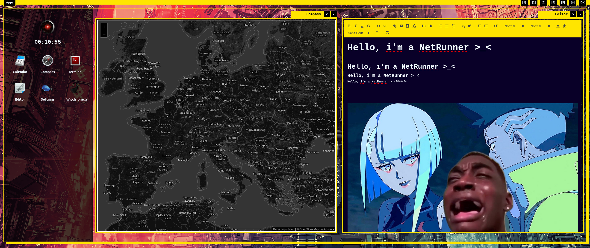
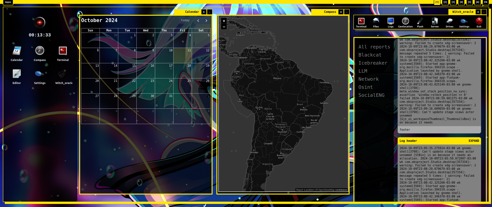

### CyperPunk DE: The Ultimate Netrunner Choice!

We have some problems now! The exponencial complexity of building new apps and the fixing build system.
Every update is complex; the apps are simple because they need to be, turn out this project is unmatainable.
If somehow works will be a nightmare to maintain.

This project needs to archive some goals first:

1. A standard library to integrate RUST and JS with unit tests
2. A standard UI and JS library, sharable between all apps
3. Support for OpenGL 2.0
4. Support for Multimedia
5. An library for keyboard shortcuts

All these topics are now a role-complex application in themselves, then what? give up?
No, just planning

#### Cyberpunk DE is compatible with almost all major OS's

* *Linux
* *BSD
* Mac OS
* Windows
* Android/IOS comming soon

#### A Complete Micro Desktop Environment Inspired by Cyberpunk 2077, Written in **Rust**

CyperPunk DE is a unique micro desktop environment inspired by Cyberpunk 2077. This project is written in Rust and offers a
powerful and sleek interface for netrunners. Originally part of the Witch_Craft netrunner firmware the Universal Hacking Tool and Automation Engine,
CyperPunk DE integrates seamlessly with Witch_Craft through both terminal and pre-installed app.

### Install

#### Pre-compiled

Use the self installer:
```bash
sh -c "$(curl -fsSL https://raw.githubusercontent.com/cosmic-zip/cyberpunk/master/install.sh)"
```

Download and extract the package from the latest release:
```bash
chmod +x install.sh
sudo ./install.sh
```

Build from source:
```bash
git clone https://github.com/cosmic-zip/cyberpunk_de
cd cyberpunk_de
chmod +x build_install.sh
sudo ./build_install.sh
```

#### Development and Customization

To add new apps or updates, you will need the following:
1. Development web server
2. Cargo and Tauri
3. The `build.py` and `server.sh` scripts

The `build.py` script builds every app into a single page, like an SPA (Single Page Application).

Start the server:
```bash
cd /src/server.sh
```

If you modify the HTML, you need to build again (Automating this step is on the to-do list):
```bash
cd ./build.py
```


#### Wait, It's All HTML? Always Has Been!

Many desktop environments, including GNOME, use a combination of JavaScript and HTML/XML or similar markup languages.
The exception lies in GUIs that utilize OpenGL or other 3D engines. CyperPunk DE follows a similar approach, with its
apps written in HTML, CSS, and small amounts of JavaScript, using libraries such as QuillJS and jQuery.

#### Then, It Must Be Slow? No, It's Not!

CyperPunk DE is built using Tauri, with its core in Rust and a CLI leveraging Node.js. This combination ensures a
lightweight and fast environment.

#### Does It Use Electron? No.

#### Are Tauri and Electron the Same Thing? No, But Actually, Yes.

While Tauri and Electron are similar, CyperPunk DE uses Tauri to maintain a compact size of around 25MB, addressing concerns about LE'bloat.

# Gallery





## Icons from:


```txt
||                                                 ||
 ===================================================
        ____   ____                ___
       /   /  /   /               /  /
      /   /__/   /               /  /
     /          / ___  ___  ____/  / ______  ______
    /   ___    / /  / /  / / __   / /  ___/ / __  /
   /   /  /   / /  /_/  / / /_/  / /  /    / /_/ /
  /___/  /___/ /____   / /______/ /__/    /_____/
  _________________/  / ____  ___  ____        _
 /                   / /   / / _/ /   /   /\/\|_)
/___________________/ / __/ /_/  /___/
                     /_/

 ===================================================
||                                                 ||
||                 DOCK ICONS BY                   ||
||                  BEN FLEMING                    ||
||                                                 ||
||                     VISIT                       ||
||           mediadesign.deviantart.com            ||
||                   FOR  MORE                     ||
||                                                 ||
 ===================================================

          [[[[[[ www.opclans.com ]]]]]]]

These icons are now available for commercial use!
You don't have to ask permission to use them, however it would be nice
if you could inform me that you're using them, and what you're using them for.
```
